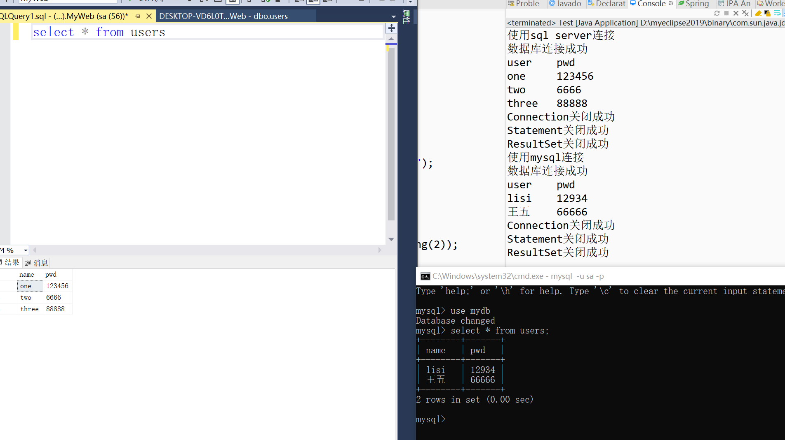

# 使用工厂模式设计数据库连接池
## 定义SQLConnection接口,要求实现获取Connection方法
```
public interface SQLConnection {
	/**
	 * 获取数据库连接
	 * @param database 数据库名
	 * @param user 用户名
	 * @param pwd 密码
	 * @return
	 */
	public Connection getConn(String database,String user,String pwd);	
}

```

## 为Sql Server设计连接工具
```
public class SQLServer implements SQLConnection {

	@Override
	public Connection getConn(String database, String user, String pwd) {
		try {
			Class.forName("com.microsoft.sqlserver.jdbc.SQLServerDriver");
			return DriverManager.getConnection("jdbc:sqlserver://localhost:1433;databaseName="+database,user,pwd);
		}catch(ClassNotFoundException e) {
			System.out.println("驱动程序加载失败");
			e.printStackTrace();
		} catch (SQLException e) {
			System.out.println("数据库连接失败");
			e.printStackTrace();
		}
		return null;
	}
}
```

## 为mysql 设计数据库连接工具
```
public class SQLMysql implements SQLConnection {

	@Override
	public Connection getConn(String database, String user, String pwd) {
		try {
			Class.forName("com.mysql.jdbc.Driver");
			return DriverManager.getConnection("jdbc:mysql://localhost:3306/"+database,user,pwd);
		}catch(ClassNotFoundException e) {
			System.out.println("驱动程序加载失败");
			e.printStackTrace();
		} catch (SQLException e) {
			System.out.println("数据库连接失败");
			e.printStackTrace();
		}
		return null;
	}

}
```

## 创建工厂
```
public class ConnectionFactory {
	/**
	 * 
	 * @param sqlType 根据sqltype决定实例化指定对象
	 * @param database 数据库名
	 * @param user 用户名
	 * @param pwd 密码
	 * @return
	 */
	public Connection getConn(String sqlType,String database,String user,String pwd) {
		Connection conn=null;
		if("SQLSERVER".equalsIgnoreCase(sqlType)) {
			conn=new SQLServer().getConn(database, user, pwd);
		}else if("MYSQL".equalsIgnoreCase(sqlType)) {
			conn=new SQLMysql().getConn(database, user, pwd);
		}
		if(conn==null) {
			System.out.println("数据库连接失败");
		}
		else {
			System.out.println("数据库连接成功");
		}
		return conn;
	}
	/**
	 * 	关闭数据库相关连接
	 * @param conn
	 * @param st
	 * @param rs
	 */
	public static void close(Connection conn,Statement st,ResultSet rs) {
		try {
			if(conn!=null) {
				conn.close();
			}
		}catch(SQLException e){
			System.out.println("Connection关闭失败");
			e.printStackTrace();
		}finally {
			System.out.println("Connection关闭成功");
		}
		
		try {
			if(st!=null) {
				st.close();
			}
		}catch(SQLException e){
			System.out.println("Statement关闭失败");
			e.printStackTrace();
		}finally {
			System.out.println("Statement关闭成功");
		}

		
		try {
			if(rs!=null) {
				rs.close();
			}
		}catch(SQLException e){
			System.out.println("ResultSet关闭失败");
			e.printStackTrace();
		}finally {
			System.out.println("ResultSet关闭成功");
		}

	}
}
```

## 测试效果
```
public class Test {
	private static Connection conn = null;
	private static String sql = "select * from users";

	public static void main(String[] args) {
		ConnectionFactory factory = new ConnectionFactory();
		// 使用sql server连接
		System.out.println("使用sql server连接");
		conn = factory.getConn("sqlserver", "MyWeb", "sa", "123456");
		try {
			Statement st = conn.createStatement();
			ResultSet rs = st.executeQuery(sql);
			System.out.println("user\tpwd");
			while(rs.next()) {
				System.out.println(rs.getString(1)+"\t"+rs.getString(2));
			}
		}catch(SQLException e) {
			e.printStackTrace();
		}

		factory.close(conn, null, null);
		// 使用mysql连接
		System.out.println("使用mysql连接");
		conn = factory.getConn("mysql", "mydb", "sa", "123456");
		try {
			Statement st = conn.createStatement();
			ResultSet rs = st.executeQuery(sql);
			System.out.println("user\tpwd");
			while(rs.next()) {
				System.out.println(rs.getString(1)+"\t"+rs.getString(2));
			}
		}catch(SQLException e) {
			e.printStackTrace();
		}
		factory.close(conn, null, null);
	}
}
```

## 结果

